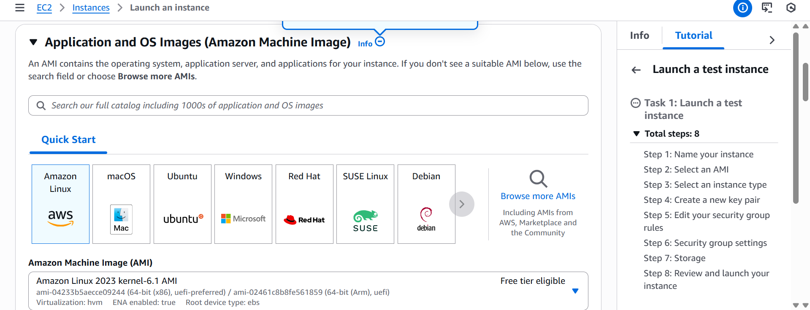
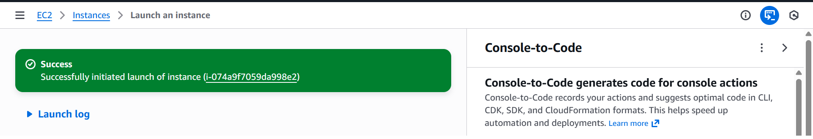
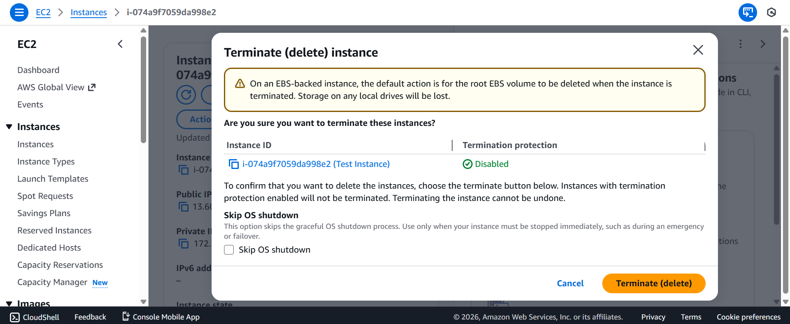
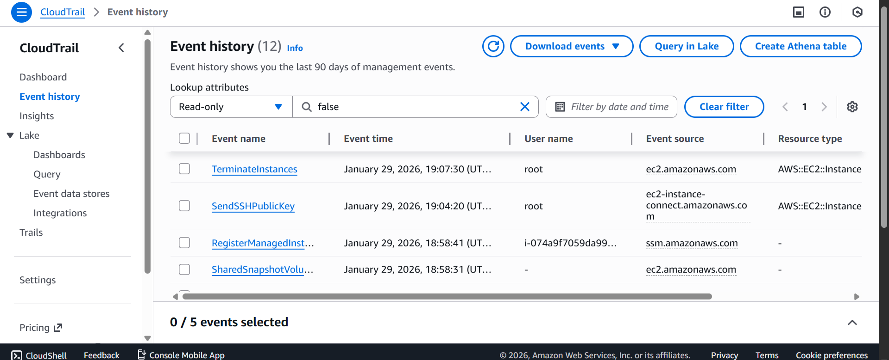

# ec2-practice
My first AWS EC2 hands on practice. Launching, running and terminating instances.

## Overview
This is my first pratical experience with with Amazon EC2,including launching, monitoring and terminating an instance.

## What i did
-Launched an ec2 instance using the AWS Management Console
-Created and used a key pair
-Started and terminated the instance safely
-Enabled AWS Cloudtrail to track instance activity logs
-Setup AWS Billing alarms too receive cost notifications via email

## AWS Services Used
-AWS EC2
-AWS Cloudtrail
-AWS Billing & Cost Management 

## Key things i learnt
- How ec2 instances are created and managed
- How AWS logs user and resource activity using cloudtrail
- How to monitor spending and avoid unexpected charges

## Screenshots

